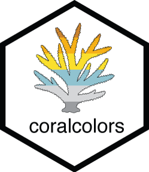

# coralcolors 

The `coralcolors` package provides color scales for plotting in R based on nature’s most stunning and colorful organisms: scleractinian corals.

#TeamCoral in its colorful glory.

## Installation

```{r, eval=FALSE}
library(devtools)

devtools::install_github("marineecologist/coralcolors", force = TRUE)

```

### list coralcolors 

To list the current list of coral taxa, use:

```{r, eval=TRUE}

library(coralcolors)

names(coral_palettes)

```

### plot coralcolors

Use `show_colors()` to view color palettes:

```{r, eval=FALSE}

show_colors(coral_palettes$acropora2)

```


## plot coralcolors

```{r, eval=FALSE}
library(ggplot2)
library(tidyverse)
library(coralcolors)

ggplot() + theme_bw() +
  geom_raster(data = faithfuld, aes(waiting, eruptions, fill = density)) +
  scale_fill_coral(palette="acanthastrea", discrete=FALSE)
```

{width="674"}
