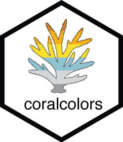

# coralcolors 

The `coralcolors` package provides color scales for plotting in R based
on nature’s most stunning and colorful organisms: scleractinian corals.

\#TeamCoral in its colorful glory.

## Installation

``` r
library(devtools)
devtools::install_github("marineecologist/coralcolors", force = TRUE)
```

### coralcolor splcales

To view the current list of coral taxa, use:

``` r
library(coralcolors)

names(coral_palettes)
```

    ##  [1] "acanthastrea"    "acropora1"       "acropora2"       "acropora3"       "acropora4"       "australophyllia" "cyphastrea"     
    ##  [8] "montipora"       "micromussa"      "porites"         "seriatopora"     "symbiodinium"

Use `show_colors()` to view color palettes:

``` r
show_colors(coral_palettes$acropora2)
```

<!-- -->
